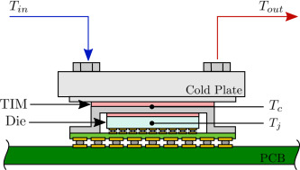

Liquid-Cooled Plant Equipment
===============================

**Jeremy Lerond, Pacific Northwest National Laboratory**

 - Original Date: 06/2026
 - Revision Date: 07/2026

## Justification for New Feature ##

The rapid expansion of datacenter projects across the US has driven industry stakeholders to request native modeling capabilities for liquid-cooled ITE in EnergyPlus, as documented in [[0]][Issue #11408]. Currently, EnergyPlus lacks plant equipment capable of modeling loads introduced by ElectricEquipment:ITE objects. This NFP proposes a new plant equipment object designed to capture these loads and interact with supply-side plant equipment to satisfy them.

## E-mail and Conference Call Conclusions ##

## Overview ##

[[0]][Issue #11408] provides an overview of current liquid-cooled datacenter technologies. Expanded information is available in [[1]][Datacenter Liquid Cooling Market Characterization, Final Report, 12/12/2025, CalNEXT]. Based on these resources, rear-door heat exchanger (RDHx) and direct-to-chip (D2C) technologies emerge as the dominant solutions. Immersion cooling remains limited to experimental applications and is not yet widely deployed. Consequently, this proposal focuses on developing a new plant equipment object capable of simulating D2C cooling. RDHx will be considered next.

## Approach ##

The new feature proposal introduces a plant object for modeling D2C cooling of `ElectricEquipment:ITE:LiquidCooled` objects. While research [[1]][Datacenter Liquid Cooling Market Characterization, Final Report, 12/12/2025, CalNEXT] and [[11]][Fernandes et al.] demonstrates that D2C and RDHx systems can work together to cool a single server rack, the current plant object design handles only one cooling system per rack. Hybrid cooling configurations could be modeled in future updates once RDHx support is available.

### D2C
The new object will simulate D2C cooling devices as a cold plate (liquid-to-solid) heat exchanger. The heat transfer through the cold plate can be characterized by the interface's case-to-fluid thermal resistance. As documented in [[2]][Wang et al.], [[3]][Cheng et al.], [[4]][Shaeri et al.], and [[6]][Martinez et al.], the case-to-fluid thermal resistance of a cold plate, $R_{th}$, is expressed as follows: 

$R_{th} = \frac{T_{case} - T_f}{\dot{q}}$

Where:
- $T_{case}$ is the case temperature (see $T_{c}$ in Figure 1 below where TIM is the thermal interface material)
- $T_{f}$ is the liquid coolant temperature
- $\dot{q}$ is the heat transfer rate

As mentioned in [[2]][Wang et al.], $T_{f}$ corresponds to the inlet fluid temperature for single-phase coolant, while for two-phase coolant $T_{f}$ is taken as the saturation temperature inside the cold plate.

The enthalpy of the fluid leaving the cold plate will be calculated as follows:

$h_{out} = h_{in} + \frac{\dot{q}}{\dot{m}}$

Temperature and other properties will subsequently be calculated based on the fluid properties data.



_Figure 1 - Cross Section of a Cold Plate_ (source: [[6]][Martinez et al.])


[[5]][Eaton] shows that cold plate designs are selected based on a maximum allowable cold plate temperature. Since $R_{th}$ is a function of $T_{case}$, a user-defined maximum case temperature will be used to estimate the maximum heat transfer rate at nominal conditions. As mentioned in [[0]][Issue #11408], D2C cooling systems are not always able to address all IT-generated loads, and air systems are used to meet the remainder. When the maximum $T_{case}$ is reached, the rest of the heat generated will be added to the zone heat balance.

[[2]][Wang et al.], [[3]][Cheng et al.], and [[4]][Shaeri et al.] show that the thermal resistance varies as a function of coolant flow rate and heat flux (for two-phase flow), so the nominal thermal resistance will be adjusted using a user-defined empirical curve.

The proposed object will be added by users to the demand side of a `PlantLoop` and, together with a `HeatExchanger:FluidToFluid` object and a pump (on the supply side of the same `PlantLoop`), will represent a coolant distribution unit (CDU). As requested by [[0]][Issue #11408], this approach allows D2C to "_be connected to existing EnergyPlus PlantLoop architecture_" and "_support for liquids with other heat transfer properties would be handled at the loop level with the fluid_type and user_defined_fluid_type fields_". Coolant properties can be specified using the `FluidProperties` family of objects. Note that PG25, which according to the literature (see [[2]][Wang et al.]) is a widely used single-phase coolant (a mixture of 25% propylene glycol and water), is natively supported by EnergyPlus when using the `FluidProperties:GlycolConcentration` object. Two-phase heat transfer is not currently handled in EnergyPlus, so we propose to focus on single-phase D2C this FY and add capabilities for two-phase D2C in the next FY.

Moreover, [[6]][Martinez et al.] propose an LMTD-based thermal resistance ($R_{LMTD}$) definition for single-phase liquid-cooled cold plates. The default implementation uses the $R_{th}$ approach, though users may optionally apply the $R_{LMTD}$ approach instead.

## Testing/Validation/Data Sources ##

TBD

## Input Output Reference Documentation ##

TBD

## Input Description ##

```
Coil:Cooling:ITE:ColdPlate
    A1, \field Name
        \required-field
        \type alpha
    A2, \field Availability Schedule Name
        \note Availability schedule name for this cold plate. Schedule value > 0 means the cold plate is available:
        \note - If this field is blank, the cold plate is always available
        \note - If the cold plate is not available, all heat passed by the ElectricEquipment:ITE:LiquidCooled object
        \note   will be added to the zone specified in this object
        \type object-list
    A3, \field Inlet Node
        \note Inlet node name
        \required-field
        \type node
    A4, \field Outlet Node
        \note Outlet node name
        \required-field
        \type node
    N1, \field Nominal Thermal Resistance
        \note This is the cold plate thermal resistance at the nominal flow rate
        \default 0.025
        \minimum> 0.0
        \units K/W
    N2, \field Maximum Case Temperature
        \note Maximum allowed case temperature
        \minimum> 0.0
    A5, \field Thermal Resistance Degradation Curve Name
        \type object-list
        \object-list UnivariateFunctions
        \object-list BivariateFunctions
        \note Flow rate ratio (Flow rate / Nominal Flow Rate) is used as the first independent variable
        \note Heat transfer rate ratio (Heat transfer rate / Nominal Transfer Rate) is used as the second independent variable
    A6, \field Use LMTD Thermal Resistance
        \note If No, the thermal resistance is defined as follows:
        \note R = (Tc - Tf) / q_dot 
        \note Where R is the Nominal Thermal Resistance
        \note Tc is the case temperature
        \note Tf is the liquid inlet temperature 
        \note q_dot is the heat flow to the cold plate
        \note If Yes, a LMTD-based thermal resistance is considered
        \note R = LMTD / q_dot
        \type choice
        \key Yes
        \key No
        \default No
    N3, \field Nominal Liquid Flow Rate
        \note Nominal liquid flow rate of the device
        \autosizable
        \minimum> 0.0
        \units m3/s
    N4, \field Auxiliary Electric Power
        \type real
        \units W
        \minimum 0.0
        \ip-units W
        \default 0.0
        \note The auxiliary electric power input in watts when the unit is available
    A7, \field Zone Name
        \note Zone where excess heat from the heat exchanger will be discharged
        \type object-list
        \object-list ZoneNames
    A8; \field End-Use Subcategory
        \note Any text may be used here to categorize the end-uses in the ABUPS End Uses by Subcategory table
        \type alpha
        \retaincase
        \default General
```

## Outputs Description ##

TBD

## Engineering Reference ##

TBD

## Example File and Transition Changes ##

This new object, along with the other liquid-cooled data center objects, will be integrated into a single example file. This effort will be coordinated with other entities involved in the development of these liquid-cooled data center objects.

No transition will be required.

## References ##

- [0] Issue #11408

[Issue #11408]: https://github.com/NatLabRockies/EnergyPlus/issues/11408

- [1] Datacenter Liquid Cooling Market Characterization, Final Report, 12/12/2025, CalNEXT 

[Datacenter Liquid Cooling Market Characterization, Final Report, 12/12/2025, CalNEXT]: https://calnext.com/wp-content/uploads/2025/12/ET24SWE0065_Datacenter-Liquid-Cooling-Market-Characterization_Final-Report.pdf

- [2] Universal Direct-to-Chip Cold Plates for Single- and Two-Phase Cooling, Wang et al.

[Wang et al.]: https://accelsius.com/wp-content/uploads/Universal-Direct-to-Chip-Cold-Plate-2.pdf

- [3] OCP OAI System Liquid Cooling Guidelines, Cheng et al.

[Cheng et al.]: https://www.opencompute.org/documents/oai-system-liquid-cooling-guidelines-in-ocp-template-mar-3-2023-update-pdf

- [4] Demonstration of CTE-Matched Two-Phase Minichannel Heat Sink, Shaeri et al.

[Shaeri et al.]: https://ieeexplore.ieee.org/stamp/stamp.jsp?tp=&arnumber=10177605&utm_source=sciencedirect_contenthosting&getft_integrator=sciencedirect_contenthosting

- [5] Selecting a Liquid Cold Plate Technology

[Eaton]: https://www.eaton.com/us/en-us/products/thermal-management-solutions/cold-plate-heat-exchanger/selecting-a-cold-plate-technology-and-performance-comparison.html

- [6] Experimental validation of the effectiveness-NTU approach for single-phase liquid cold plates and a consistent definition of thermal resistance

[Martinez et al.]: https://www.sciencedirect.com/science/article/pii/S0017931025004673

- [7] Performance Comparison of R1233zd(E) and R515B for Two-Phase Direct-to-Chip Cooling

[Wang et al. 2]: https://ieeexplore.ieee.org/stamp/stamp.jsp?arnumber=11235787

- [8] Rear-Door Heat Exchangers Smart Cooling at the Rack Level

[Legrand]: https://www.legrand.com/datacenter/at-en/news/rear-door-heat-exchangers-rdhx-smart-cooling-at-the-rack-level

- [9] A Practical Metric for Cold Plate Thermal Performance in Two-Phase Direct-to-Chip Cooling

[Wang et al. 3]: https://accelsius.com/wp-content/uploads/A-Practical-Metric-for-Cold-Plate-Thermal-Performance-in-Two-Phase-Direct-to-Chip-Cooling.pdf

- [10] Experimental evaluation of direct-to-chip cold plate liquid cooling for high-heat-density data centers

[Heydari et al.]: https://www.sciencedirect.com/science/article/pii/S1359431123021518?casa_token=yMz4c59NaAoAAAAA:njacRyk_Tos7PSyigDx1yWpRixkV3-Vbiqv1IR7vkgFqLkSTbfue6P6pvFMKMt6bWbwFj4f9aQ

- [11] Liquid to Liquid CDU Test Methodology and Performance Rating

[Wondium et al.]: https://www.opencompute.org/documents/ocp-wp-l-lcdu-test-methodology-performance-rating-r1-pdf

- [12] ACS Door Heat Exchanger Requirements for Open Rack

[Fernandes et al.]: https://www.opencompute.org/documents/acs-door-hx-open-compute-requirements-for-open-rack-rev1-0-1-pdf