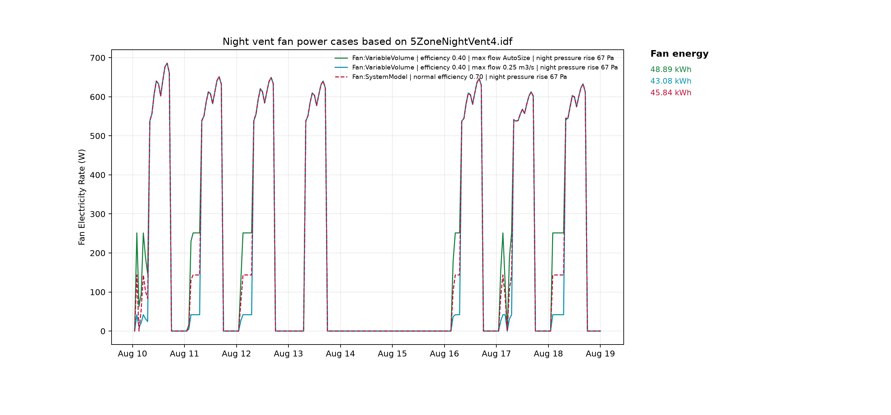
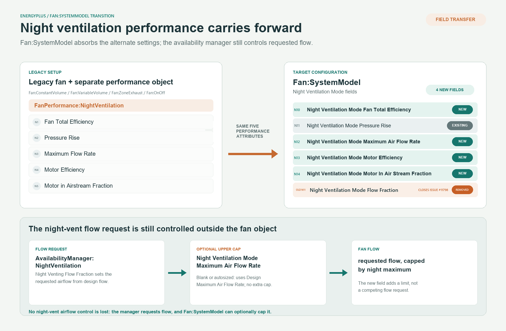

Fan:SystemModel Night Ventilation Mode Fields
=====================================================

**Joe Robertson, National Laboratory of the Rockies**

 - September 22, 2026 - Initial Draft

## Justification for New Feature ##

`FanPerformance:NightVentilation` lets a modeler specify an alternate fan efficiency, pressure rise, motor efficiency, motor-in-airstream fraction, and maximum flow rate that apply only while `AvailabilityManager:NightVentilation` has forced the fan into night ventilation mode.
It is documented as applying to `Fan:ConstantVolume`, `Fan:VariableVolume`, `Fan:ZoneExhaust`, and `Fan:OnOff`.

`Fan:SystemModel` was intended to replace the legacy fan objects and their separate night-ventilation performance object. Today it supports a night pressure-rise override, but its `Night Ventilation Mode Flow Fraction` input is unused; requested flow is controlled by `AvailabilityManager:NightVentilation`. It cannot specify alternate night efficiency or motor performance, or independently cap night flow, so it is less capable in this mode than `Fan:VariableVolume` with `FanPerformance:NightVentilation`.

The FY2016 NFP, "A New Versatile Fan," explicitly says the new fan should make `FanPerformance:NightVentilation` unnecessary, but its proposed interface listed only pressure rise and flow fraction. This points to an incomplete replacement scope rather than an intentional change to night-ventilation behavior.

The comparison below illustrates this capability gap.



This work (tracked under issue #11798, and related to the broader inconsistency reported in issue #11808 across fan types) reworks the `Fan:SystemModel` night ventilation inputs so that:

1. The dead `Night Ventilation Mode Flow Fraction` field is removed.
2. `Fan:SystemModel` gains the same alternate total efficiency, motor efficiency, and motor-in-airstream-fraction inputs that `FanPerformance:NightVentilation` already offers to the legacy fan types.
3. `Fan:SystemModel` gains an optional, autosizable maximum air flow rate cap for night ventilation mode, mirroring `FanPerformance:NightVentilation`'s `Maximum Flow Rate` field, so that a fan's night-vent flow can be limited independently of (and in addition to) whatever flow fraction `AvailabilityManager:NightVentilation` requests.

## Overview ##

`Fan:SystemModel` already has a `Night Ventilation Mode Pressure Rise` field used to substitute a different pressure rise when `state.dataHVACGlobal->NightVentOn` is true.
That pattern is extended to cover the remaining alternate-performance parameters offered by `FanPerformance:NightVentilation`:

- `Night Ventilation Mode Fan Total Efficiency` (optional; falls back to `Fan Total Efficiency` if blank)
- `Night Ventilation Mode Motor Efficiency` (optional; falls back to `Motor Efficiency` if blank)
- `Night Ventilation Mode Motor In Air Stream Fraction` (optional; falls back to `Motor In Air Stream Fraction` if blank)
- `Night Ventilation Mode Maximum Air Flow Rate` (optional and autosizable; falls back to `Design Maximum Air Flow Rate` - i.e., no additional cap - if left blank or autosized)

None of these fields affect the flow rate the fan is asked to move; that continues to be set entirely by `AvailabilityManager:NightVentilation`'s `Night Venting Flow Fraction`.
The `Night Ventilation Mode Maximum Air Flow Rate` field only clips that requested flow to no more than the specified value, exactly as `FanPerformance:NightVentilation`'s `Maximum Flow Rate` field is documented to do for the legacy fan types.

The previously unused `Night Ventilation Mode Flow Fraction` field is removed since it duplicated `AvailabilityManager:NightVentilation`'s own flow fraction field and was never consumed.



## Approach ##

### IDD ###

In `Fan:SystemModel`, `Night Ventilation Mode Flow Fraction` is removed and replaced with four fields: `Night Ventilation Mode Fan Total Efficiency`, `Night Ventilation Mode Maximum Air Flow Rate`, `Night Ventilation Mode Motor Efficiency`, and `Night Ventilation Mode Motor In Air Stream Fraction`. The field order mirrors `FanPerformance:NightVentilation`: fan total efficiency, pressure rise, maximum flow rate, motor efficiency, and motor in airstream fraction. Accordingly, the new fan total efficiency field is inserted immediately before the existing `Night Ventilation Mode Pressure Rise` field; the other three new fields follow pressure rise. All subsequent fields (`Motor Loss Zone Name`, `Motor Loss Radiative Fraction`, `Number of Speeds`, and the `Speed n` extensible field sets) shift by a net three numeric field positions versus the pre-existing schema:

```
  N10, \field Night Ventilation Mode Fan Total Efficiency
       \note Fan total efficiency to use when in night mode using AvailabilityManager:NightVentilation
       \note If left blank the Fan Total Efficiency field above is used.
       \type real
       \minimum> 0.0
       \maximum 1.0
  N11, \field Night Ventilation Mode Pressure Rise
       \note Total system fan pressure rise at the fan when in night mode using AvailabilityManager:NightVentilation
       \type real
       \units Pa
       \ip-units inH2O
  N12, \field Night Ventilation Mode Maximum Air Flow Rate
       \type real
       \units m3/s
       \minimum 0.0
       \autosizable
       \default autosize
       \note Maximum standard-density volumetric air flow rate when the fan operates in night ventilation mode.
       \note If left blank or autosized, this field is set to the fan's Design Maximum Air Flow Rate.
       \note AvailabilityManager:NightVentilation Night Venting Flow Fraction requests a fraction of the fan's Design Maximum Air Flow Rate.
       \note This field is then used as an upper limit on the resulting night ventilation fan flow rate.
  N13, \field Night Ventilation Mode Motor Efficiency
       \note Fan motor efficiency to use when in night mode using AvailabilityManager:NightVentilation
       \note If left blank the Motor Efficiency field above is used.
       \type real
       \minimum> 0.0
       \maximum 1.0
  N14, \field Night Ventilation Mode Motor In Air Stream Fraction
       \note Fraction of motor heat entering the air stream to use when in night mode using AvailabilityManager:NightVentilation
       \note If left blank the Motor In Air Stream Fraction field above is used.
       \note 0.0 means fan motor outside of air stream, 1.0 means motor inside of air stream
       \type real
       \minimum 0.0
       \maximum 1.0
```

`Fan:SystemModel`'s existing `\min-fields` remains 14; the added fields follow that position, so minimal-field objects remain valid.

### Fans.cc / Fans.hh ###

`FanSystem` (the `Fan:SystemModel` implementation class) gains:
```cpp
Real64 nightVentMaxAirFlowRate = 0.0;
Real64 nightVentMaxAirMassFlowRate = 0.0;        // [kg/s]
Real64 nightVentTotalEff = 0.0;                  // 0.0 means not specified
Real64 nightVentMotorEff = 0.0;                  // 0.0 means not specified
Real64 nightVentMotorInAirFrac = 0.0;
bool nightVentMotorInAirFracSpecified = false;
```

`GetFanInput` parses the four new/changed numeric fields. The IDD's `\default autosize` causes a blank maximum flow rate to be read as `DataSizing::AutoSize`; an explicit `0.0` remains a zero-flow cap.

`FanSystem::set_size` resolves the night-vent maximum flow rate once the fan's normal `maxAirFlowRate` has been sized:
```cpp
if (nightVentMaxAirFlowRate == DataSizing::AutoSize) {
    nightVentMaxAirFlowRate = maxAirFlowRate;
}
nightVentMaxAirMassFlowRate = nightVentMaxAirFlowRate * rhoAirStdInit;
```
Both "left blank" and "autosize" resolve to the design maximum air flow rate, i.e., no additional cap beyond the fan's normal maximum.

`FanSystem::calcSimpleSystemFan` computes local, per-timestep values that use the night-vent alternates only when `state.dataHVACGlobal->NightVentOn` is true, following the same pattern already used for `nightVentPressureDelta`:
```cpp
Real64 _localFanTotalEff = (state.dataHVACGlobal->NightVentOn && nightVentTotalEff > 0.0) ? nightVentTotalEff : totalEff;
Real64 _localMotorEff = (state.dataHVACGlobal->NightVentOn && nightVentMotorEff > 0.0) ? nightVentMotorEff : motorEff;
Real64 _localMotorInAirFrac =
    (state.dataHVACGlobal->NightVentOn && nightVentMotorInAirFracSpecified) ? nightVentMotorInAirFrac : motorInAirFrac;
Real64 _localMaxAirMassFlowRate = state.dataHVACGlobal->NightVentOn ? nightVentMaxAirMassFlowRate : maxAirMassFlowRate;
```
`_localMaxAirMassFlowRate` then replaces `maxAirMassFlowRate` everywhere within this function that the requested mass flow is clipped to the fan's maximum (the EMS-override clip, the flow-fraction calculation, and the flow-ratio calculation), so the night ventilation cap is enforced consistently regardless of speed control method (`Discrete` or `Continuous`) or how many operating modes are active.

### ExpandObjects ###

HVACTemplate-driven expansion to `Fan:SystemModel` emits the new fields blank, in the same position, so generated objects remain valid.

### Transition ###

The `V26.2 -> V27.1` `FAN:SYSTEMMODEL` rule inserts a blank `Night Ventilation Mode Fan Total Efficiency` before the existing `Night Ventilation Mode Pressure Rise`, preserving the old pressure-rise value in its new position. It removes the old `Night Ventilation Mode Flow Fraction` value and inserts blank fields for `Night Ventilation Mode Maximum Air Flow Rate`, `Night Ventilation Mode Motor Efficiency`, and `Night Ventilation Mode Motor In Air Stream Fraction`. Trailing fields (`Motor Loss Zone Name` onward) shift by a net three numeric field positions. Records that do not reach the old pressure-rise field are passed through unchanged; records that include pressure rise but omit the old flow-fraction field still need the pressure-rise position shifted.

## Testing/Validation/Data Sources ##

- New/updated unit tests exercise `GetFanInput` field parsing (including the autosize path) and `calcSimpleSystemFan`'s night-vent flow cap, alternate efficiency, and motor-fraction behavior for both `Discrete` and `Continuous` speed control.
- Transition pytest coverage (`src/Transition/tests/26_2_0/test_fan_systemmodel.py`) covers records ending before, at, and after the removed field, including one with `Number of Speeds`/speed field sets present.
- All `testfiles/*.idf` and embedded `tst/EnergyPlus/unit/*.unit.cc` `Fan:SystemModel` objects were mechanically updated to insert the new blank field(s) so existing regression tests continue to parse and run unchanged (all new fields left blank preserves prior behavior).
- `testfiles/5ZoneNightVent3.idf` additionally exercises the alternate total efficiency/motor efficiency/motor-in-airstream-fraction fields (populated to match its companion `5ZoneNightVent4.idf`'s `FanPerformance:NightVentilation` values) to keep the two demonstration files equivalent.

## Input Output Reference Documentation ##

Updated `doc/input-output-reference/src/overview/group-fans.tex` with descriptions and fallback behavior for the new fields, and removed the unused `Night Ventilation Mode Flow Fraction` description.

## Outputs Description ##

No new output variables. Existing predefined tabular report entries (e.g., Fan Total Efficiency, Autosized flag) are unaffected; they continue to report the normal (non-night-vent) design values.

## References ##

- Issue #11798 (Fan:SystemModel night ventilation field rework)
- Issue #11808 (Inconsistent/inaccurate FanPerformance:NightVentilation handling across fan types)
- `FanPerformance:NightVentilation` object (existing legacy fan alternate-performance object this work mirrors)
- [design/FY2016/New Fan Design Document.md](https://github.com/NatLabRockies/EnergyPlus/blob/develop/design/FY2016/New%20Fan%20Design%20Document.md) - "A New Versatile Fan" (B. Griffith, 2015), the original NFP that introduced `Fan:SystemModel` and first stated the intent that it make `FanPerformance:NightVentilation` unnecessary
