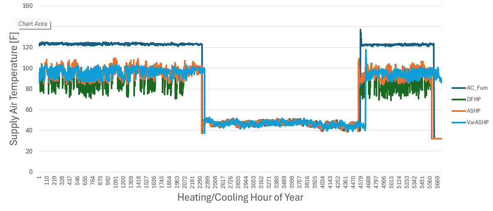
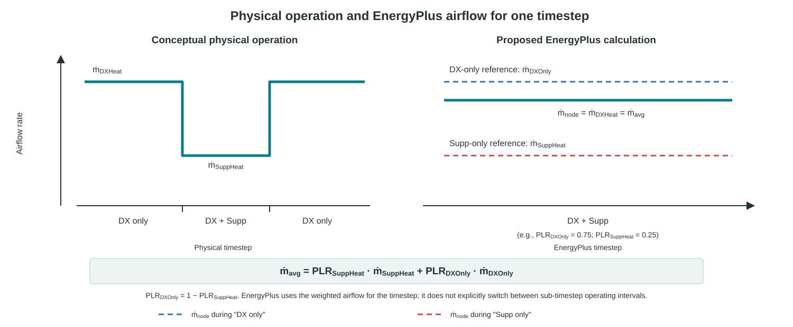

Supplemental Heating Supply Airflow for AirLoopHVAC:UnitarySystem
================================================================

**Joe Robertson, National Laboratory of the Rockies**

 - October 7, 2026 - Initial Draft

## Justification for New Feature ##

`AirLoopHVAC:UnitarySystem` provides separate supply airflow inputs for cooling,
primary heating, and no-load operation, but not for supplemental heating.

Residential heat pumps commonly use different blower settings for heat-pump
heating and auxiliary or backup heating. This is particularly important for
dual-fuel systems, where a backup furnace generally operates with a lower
airflow and higher supply-air temperature than the heat pump.

Using the primary heating airflow during supplemental heating can overpredict
fan electricity, underpredict supply-air temperature, underpredict duct
distribution losses in unconditioned spaces, and incorrectly evaluate
airflow-dependent DX coil performance.

Annual supply-air-temperature comparisons for different HVAC system types show
the key symptom: for a dual-fuel heat pump case, the supply-air temperature
during backup furnace operation should rise toward the level seen in a
conventional AC-plus-furnace system, but instead it falls. The same comparison
indicates that the system airflow is too high during backup heat operation. The
resulting errors are specifically that the backup fan energy is overstated and
any duct distribution losses in unconditioned spaces are understated.



## E-mail and Conference Call Conclusions ##

The initial implementation will be limited to sensible residential heating
applications without outdoor-air mixing or dehumidification/reheat operation.
Primary and supplemental heating may operate concurrently.

For concurrent DX and supplemental heating, the supplemental-heater part-load
ratio is used as an effective weight for the supplemental-heating condition.
It may reflect capacity modulation, speed selection, or cycling and is not
necessarily the fraction of the timestep the heater operates. Node airflow
and outlet conditions will be averaged over the timestep while each component
is evaluated at its designated operating airflow.

Operation with outdoor-air mixing, cooling-coil dehumidification, or a
supplemental coil used for reheat is outside the initial scope. These cases can
be added later after the sensible-only implementation is validated.

This scope reflects the review feedback from Rich Raustad and Scott Horowitz
on the original proposal. The relevant comments are:

- Scott Horowitz, July 9, 2026: supplied the annual supply-air-temperature
  comparison figure and emphasized keeping the first implementation focused on
  residential sensible heating systems without outdoor-air mixing or
  dehumidification/reheat operation.
- Rich Raustad, July 14, 2026: identified a control-order and load-feedback
  risk. Because the supplemental heater is simulated after the primary coils,
  applying its airflow whenever it is active could change the system load,
  especially when outdoor-air effects are present. He noted that limiting the
  alternate airflow to supplemental-only operation might be simpler, but that
  the general case could be difficult.
- Rich Raustad, August 6, 2026: agreed that outdoor air should be excluded from
  the initial residential implementation and described the intended timestep
  treatment. The DX coil should be evaluated at its own operating airflow, the
  supplemental coil at its own airflow for its PLR-derived weighted condition,
  and node flow and outlet conditions should be averaged over the timestep. He also
  identified the need to use the coil airflow ratio and conserve energy, with
  concurrent DX and supplemental operation remaining more complicated than
  supplemental-only operation.
- Scott Horowitz, August 13, 2026: proposed the initial residential-only
  implementation summarized in the issue comments. The proposal allows DX and
  supplemental heating to operate concurrently, uses PLR-derived effective
  weights for airflow and node conditions, evaluates the DX and supplemental
  coils at their respective operating airflows, and applies the same weights to
  fan power between the two conditions.
- Rich Raustad, August 13, 2026: noted that the simplified DX-heating airflow
  treatment is a reasonable first approximation for the current model, with the
  caveat that future work could broaden the concept if more complete
  refrigerant-side behavior is later represented.

## Overview ##

Figure 1 compares a conceptual physical operating sequence with the proposed
EnergyPlus representation for one timestep. The physical example on the left
shows the lower supplemental-heating airflow associated with a dual-fuel heat
pump and gas-furnace backup. The EnergyPlus panel on the right shows the
concurrent-heating calculation: node and DX-coil airflow use a PLR-weighted
value, while the supplemental coil is evaluated at its specified airflow.
EnergyPlus does not explicitly switch between the physical operating states
in sub-timestep intervals. The supplemental PLR is an effective weighting
factor in this concurrent case, not necessarily a physical runtime fraction.



Figure 1. Conceptual physical airflow sequence (left) compared with the
proposed EnergyPlus airflow representation for one timestep (right). The
illustrated case has $\dot m_{SuppHeat} < \dot m_{DXOnly}$; actual relative
rates depend on the inputs. Both panels share the same airflow axis and
reference levels. The dashed blue reference is $\dot m_{node}$ during DX-only
operation; the dashed red reference is $\dot m_{node}$ during supplemental-only
operation.

During concurrent DX and supplemental heating, the node and DX coil do not
simply use the specified supplemental-heating airflow. Instead, they use the
effective PLR-weighted airflow described below, while the supplemental coil is
evaluated at its specified supplemental-heating airflow. DX-only,
supplemental-only, and off/no-load operation are handled as separate
conditions.

New optional supplemental-heating supply-airflow inputs will be added to
`AirLoopHVAC:UnitarySystem`.

The original proposal limits the initial input to residential systems without
outdoor-air mixing or dehumidification. The airflow used depends on which
heating components are operating:

- DX heat only: use the existing primary heating airflow.
- Supplemental heat only, such as during compressor lockout: use the
  supplemental heating airflow.
- DX and supplemental heat concurrently: use the proposal's two-condition
  effective weighting to determine node airflow (also used by the DX heating
  coil) and average fan power; operate the supplemental heating coil at its
  specified supplemental heating airflow.
- Neither heating condition: retain the existing compressor-off/no-load
  behavior. Depending on fan operation, this is the configured no-load airflow
  for a continuous fan or zero airflow for a cycling fan.

The two-condition weighting applies only to concurrent DX and supplemental
heating. It must not blend the supplemental airflow into a DX-only period or
the DX airflow into a supplemental-only period. The compressor-off/no-load
condition is a separate fan operating mode and must be accounted for when it
occupies part of the timestep.

For concurrent heating, the proposal describes the represented heating period
using two weighted operating conditions:

$$
\dot m_{avg,concurrent}=PLR_{SuppHeat}\dot m_{SuppHeat}+
PLR_{DXOnly}\dot m_{DXOnly}
$$

The DX heating coil airflow rate is the same as the node airflow rate:

$$
\dot m_{DX}=\dot m_{avg,concurrent}
$$

The supplemental heating coil uses its specified airflow rate:

$$
\dot m_{SuppHeatCoil}=\dot m_{SuppHeat}
$$

Fan power uses the same effective weights between the supplemental-heating and
DX-only conditions:

$$
P_{fan}=PLR_{SuppHeat}P_{SuppHeat}+
PLR_{DXOnly}P_{DXOnly}
$$

Here, $PLR_{SuppHeat}$ is calculated using the existing supplemental-heater
logic and is used as an effective supplemental-heating condition weight only
for concurrent operation. $PLR_{DXOnly}=1-PLR_{SuppHeat}$ is the corresponding
effective DX-only weight within that concurrent-heating approximation. These
weights are not used to infer DX or supplemental operation in the exclusive
DX-only or supplemental-only cases. Nor do they necessarily represent physical
runtime fractions. $\dot m_{SuppHeat}$ is the new supplemental-heating airflow
input, and $\dot m_{DXOnly}$ is the existing primary-heating airflow input.
$P_{SuppHeat}$ and $P_{DXOnly}$ are calculated at their respective operating
airflows. These equations are reproduced from the [original issue
proposal](https://github.com/NatLabRockies/EnergyPlus/issues/11166#issuecomment-5284033235).

When the new input method is blank, the supplemental heater will continue to
use the primary heating airflow and the existing calculation path. Existing
models will therefore retain their current results.

## Approach ##

### IDD ###

The following fields will be inserted into `AirLoopHVAC:UnitarySystem` without
changing the relative order of existing fields. The excerpt uses EnergyPlus
IDD syntax; the preceding fields in the object are omitted:

These fields follow `Heating Supply Air Flow Rate Per Unit of Capacity` and
precede `No Load Supply Air Flow Rate Method` in the object definition.

```text
  A22, \field Supplemental Heating Supply Air Flow Rate Method
       \type choice
       \key SupplyAirFlowRate
       \key FlowPerFloorArea
       \key FractionOfAutosizedHeatingValue
       \key FlowPerHeatingCapacity
       \note Enter the method used to determine the supplemental heating supply air volume flow rate.
       \note If this field is blank, the primary heating supply air flow rate and legacy simulation path are used.
  N11, \field Supplemental Heating Supply Air Flow Rate
       \type real
       \units m3/s
       \minimum 0.0
       \autosizable
       \note Enter the supplemental heating supply air volume flow rate.
       \note Required when Supplemental Heating Supply Air Flow Rate Method is SupplyAirFlowRate.
  N12, \field Supplemental Heating Supply Air Flow Rate Per Floor Area
       \type real
       \units m3/s-m2
       \minimum 0.0
       \note Enter the supplemental heating supply air volume flow rate per total floor area.
       \note Required when Supplemental Heating Supply Air Flow Rate Method is FlowPerFloorArea.
  N13, \field Supplemental Heating Fraction of Autosized Heating Supply Air Flow Rate
       \type real
       \minimum 0.0
       \note Enter the supplemental heating supply air volume flow rate as a fraction of the autosized heating supply air flow rate.
       \note Required when Supplemental Heating Supply Air Flow Rate Method is FractionOfAutosizedHeatingValue.
  N14, \field Supplemental Heating Supply Air Flow Rate Per Unit of Capacity
       \type real
       \units m3/s-W
       \minimum 0.0
       \note Enter the supplemental heating supply air volume flow rate as a fraction of supplemental heating capacity.
       \note Required when Supplemental Heating Supply Air Flow Rate Method is FlowPerHeatingCapacity.
```

For `FlowPerHeatingCapacity`, the airflow will be based on the supplemental
heating coil capacity. An autosized direct airflow will default to the autosized
primary heating airflow. A blank method will use the primary heating airflow
and the legacy simulation path.

### Operating-State Airflow and Fan Power ###

Let:

- $\dot m_p$ be the primary heating operating mass flow rate.
- $\dot m_s$ be the supplemental heating operating mass flow rate.
- $\dot m_o$ be the off-cycle or no-load mass flow rate.

For the concurrent DX-plus-supplemental case only, define the effective
supplemental-heating condition weight as:

$$
W_s=PLR_{SuppHeat}
$$

and the effective DX-only condition weight as:

$$
W_{DXOnly}=1-W_s
$$

These weights average the two concurrent-heating airflow and fan-power
conditions in the original proposal. They do not select the exclusive DX-only
or supplemental-only cases, and they are not automatically physical runtime
fractions. For example, a
supplemental heater that modulates at 50% capacity for the whole timestep may
have a physical runtime fraction of 1.0 while the proposal still uses
$W_s=0.5$ as the effective supplemental-heating weight. Conversely, a heater
that operates at full capacity for half the timestep may have both
$PLR_{SuppHeat}=0.5$ and a physical runtime fraction of 0.5.

The physical runtime fraction, if needed by a coil or fan model, must be
obtained separately from the component control logic. It must not be inferred
from $PLR_{SuppHeat}$ unless the supplemental heater is explicitly assumed to
operate at full capacity whenever it is on. Compressor lockout selects the
supplemental-only case; it does not make the DX-only weight apply to that case.

For concurrent operation, the represented heating airflow and fan power are:

$$
\dot m_{avg,concurrent}=W_s\dot m_s+W_{DXOnly}\dot m_p
$$

The corresponding fan-power approximation is:

$$
P_{fan,concurrent}=W_sP_s+W_{DXOnly}P_{DXOnly}
$$

For example, if $\dot m_p=1.0$, $\dot m_s=1.5$, and $W_s=0.25$,
the average flow is $1.125$.

The concurrent equations above describe the represented heating portion. If the
timestep also contains an off/no-load portion, let $F_h$ be the timestep weight
of the represented heating operation and $F_o=1-F_h$ the off/no-load weight.
Determine these timestep weights from the fan/system operating-state logic;
do not infer $F_o$ from $1-W_s$, since $W_s$ only partitions concurrent
heating.
The timestep-average flow and fan power are then:

$$
\dot m_{avg}=F_h(W_s\dot m_s+W_{DXOnly}\dot m_p)+F_o\dot m_o
$$

$$
P_{fan,avg}=F_h(W_sP_s+W_{DXOnly}P_{DXOnly})+F_oP_o
$$

For DX-only operation, set $W_s=0$ and $W_{DXOnly}=1$ for the heating portion.
For supplemental-only operation, set $W_s=1$ and $W_{DXOnly}=0$. When neither
heater operates, $F_h=0$; $\dot m_o$ and $P_o$ follow the existing fan mode:
no-load airflow and its fan power for a continuous fan, or zero airflow and
zero fan power for a cycling fan. The off/no-load weight must not be folded into
the DX-only or supplemental-only weight.

The primary/DX heating coil will use $\dot m_p$ in the DX-only case and the
calculated air-node airflow in the concurrent case. The supplemental coil will
use $\dot m_s$ in both the supplemental-only and concurrent cases.
Airflow-dependent DX coil performance curves will use the corresponding
operating airflow ratio. The concurrent two-condition approximation does not
identify whether the weighted conditions occur sequentially or through
capacity modulation. If physical states are modeled separately, the
implementation must obtain separate runtime and overlap information from the
control sequence.

The fan will be evaluated separately at each operating airflow. Preserve the
compressor-on/primary and compressor-off/no-load modes and add a third
supplemental mode so power is calculated at each mode's flow before timestep
weighting. During concurrent DX-plus-supplemental operation, apply the
effective two-condition weights only to those heating conditions; include any
compressor-off/no-load contribution separately. Outlet enthalpy will be
averaged on a dry-air mass and energy basis:

$$
h_{out,avg}=\frac{F_h\sum_{i\in\{s,DXOnly\}}W_i\dot m_i h_{out,i}+F_o\dot m_o h_o}
{F_h\sum_{i\in\{s,DXOnly\}}W_i\dot m_i+F_o\dot m_o}
$$

Humidity ratio will be averaged on the same dry-air mass basis, including the
off/no-load mode. Use physical mode runtime fractions for exclusive operating
states when available; use $W_s$ and $W_{DXOnly}$ only for the concurrent
two-condition approximation.

The supply fan design flow will be the maximum of the cooling, primary
heating, supplemental heating, and no-load operating flows. A hard-sized fan
with insufficient flow will produce input validation consistent with the
existing cooling and heating airflow checks.

### Code Translation ###

The proposed calculation maps primarily to
`src/EnergyPlus/UnitarySystem.hh` and `src/EnergyPlus/UnitarySystem.cc`. The
line numbers below are approximate locations in the current source files.

**Input and state data (`UnitarySystem.hh`, approximately lines 115-130)**

Extend `UnitarySysInputSpec` with the new method and numeric fields, alongside
the existing cooling, heating, and no-load airflow fields:

```cpp
std::string supplemental_heating_supply_air_flow_rate_method;
Real64 supplemental_heating_supply_air_flow_rate = -999.0;
Real64 supplemental_heating_supply_air_flow_rate_per_floor_area = -999.0;
Real64 supplemental_heating_fraction_of_autosized_heating_supply_air_flow_rate = -999.0;
Real64 supplemental_heating_supply_air_flow_rate_per_unit_of_capacity = -999.0;
```

**Input processing (`UnitarySystem.cc`, approximately lines 3733-4050)**

Read and validate the new fields in `processInputSpec`, preserving the legacy
path when the method is blank and rejecting the initially unsupported
outdoor-air, latent-control, and `CoolReheat` combinations:

```cpp
auto const &supplementalMethod = input_data.supplemental_heating_supply_air_flow_rate_method;
if (supplementalMethod.empty()) {
    // Use the existing primary-heating airflow path.
} else {
    // Validate method, fields, and supported operating configuration.
}
```

**Sizing (`UnitarySystem.cc`, approximately lines 1497-1930)**

Add a supplemental-heating branch parallel to the existing heating airflow
sizing logic. It should calculate the supplemental design flow for direct
input, floor-area, autosized-fraction, and capacity-based methods, then include
that flow in the supply fan design-flow checks:

```cpp
if (supplementalMethod == DataSizing::SupplyAirFlowRate) {
    supplementalFlow = inputSupplementalFlow;
} else if (supplementalMethod == DataSizing::FlowPerFloorArea) {
    supplementalFlow = supplementalFlowPerFloorArea * totalFloorArea;
} else if (supplementalMethod == DataSizing::FractionOfAutosizedHeatingAirflow) {
    supplementalFlow = supplementalFraction * autosizedHeatingFlow;
} else if (supplementalMethod == DataSizing::FlowPerHeatingCapacity) {
    supplementalFlow = supplementalFlowPerUnitCapacity * supplementalHeatingCapacity;
}
```

**Operating-state selection and component simulation (`UnitarySystem.cc`)**

`calcUnitarySystemToLoad` should select DX-only, supplemental-only, concurrent,
or no-heating operation from the current primary compressor state,
supplemental-heater load, and supplemental availability/lockout conditions. Do
not infer the current compressor state from a value left by a previous HVAC
iteration. Retain the supplemental-heater PLR as an effective weight only for
the concurrent case; it may represent capacity, speed, or cycling depending on
coil type and is not necessarily a physical runtime fraction.

`setAverageAirFlow` should preserve the existing primary airflow for DX-only
operation, use the supplemental airflow directly for supplemental-only
operation, apply the effective PLR weights only for concurrent operation, and
retain the existing compressor-off/no-load airflow behavior when neither
heating component operates. Any off/no-load timestep contribution is accounted
for separately from the concurrent DX/supplemental weights. The supplemental
coil should continue to be simulated at the resolved supplemental airflow.

The fan calculation must evaluate power at each operating airflow rather than
at the timestep-average airflow. Extend `Fan:SystemModel` to accept a third
operating mode for supplemental airflow, alongside its existing
compressor-on/primary and compressor-off/no-load modes, and weight each mode's
power contribution for the timestep.

Conceptually, pass three flow-and-weight pairs to the fan:

- Mode 1: compressor-on primary airflow.
- Mode 2: compressor-off/no-load airflow (which may be nonzero for a continuous fan).
- Mode 3: supplemental-heating airflow.

The timestep fan power is the sum of the separately evaluated mode powers:

$$
P_{fan,avg}=\sum_{i=1}^{3}F_iP_{fan}(\dot m_i)
$$

The fan is not evaluated once at the weighted-average airflow.

### Transition ###

The new fields are inserted immediately after `Heating Supply Air Flow Rate Per
Unit of Capacity` and before `No Load Supply Air Flow Rate Method`. Existing
IDF files must therefore receive five blank fields at this location:

```idf
  ,  !- Supplemental Heating Supply Air Flow Rate Method
  ,  !- Supplemental Heating Supply Air Flow Rate
  ,  !- Supplemental Heating Supply Air Flow Rate Per Floor Area
  ,  !- Supplemental Heating Fraction of Autosized Heating Supply Air Flow Rate
  ,  !- Supplemental Heating Supply Air Flow Rate Per Unit of Capacity
```

The existing no-load fields follow these inserted blanks. Blank supplemental
fields preserve the existing primary-heating airflow behavior and legacy
simulation path, so existing models retain their current results after the
field insertion. Example files and transition documentation will be updated
with the inserted blank fields.

When a supplemental heating airflow method is provided, the simulation will
use the supplemental-heating operating-state logic described above.

## Testing/Validation/Data Sources ##

Unit tests will cover:

- DX-only, supplemental-only, concurrent, and no-heating/off-cycle operation.
- Cycling- and continuous-fan operation.
- Compressor lockout, backup-heater lockout, and off/no-load behavior with
  continuous and cycling fans.
- Supplemental airflow above and below the primary heating airflow.
- Input processing, scalable sizing, autosizing, and fan-flow validation.
- Timestep mass and energy conservation.
- PLR-derived effective weights only during concurrent DX and supplemental
  heating, plus no-blend behavior in the exclusive cases.
- Unchanged results when the new fields are blank.
- Rejection of initially unsupported outdoor-air and dehumidification cases.

An annual dual-fuel example will verify that backup heating produces the
expected higher supply-air temperature, lower airflow, lower fan energy, and
increased duct losses relative to the current behavior.

Measured residential air-handler airflow settings and manufacturer
installation data attached to EnergyPlus issue #11166 will provide validation
targets.

## Input Output Reference Documentation ##

The following entries will be added to the `AirLoopHVAC:UnitarySystem`
description in `doc/input-output-reference/src/overview/group-unitary-equipment.tex`:

> **Field: Supplemental Heating Supply Air Flow Rate Method**
>
> Select the method used to determine the supplemental heating supply air flow
> rate. Choices are `SupplyAirFlowRate`, `FlowPerFloorArea`,
> `FractionOfAutosizedHeatingValue`, and `FlowPerHeatingCapacity`. If this
> field is blank, the primary heating supply air flow rate and legacy
> simulation path are used.

> **Field: Supplemental Heating Supply Air Flow Rate**
>
> Enter the supplemental heating supply air flow rate in m3/s. This field is
> required when the method is `SupplyAirFlowRate` and may be autosized.

> **Field: Supplemental Heating Supply Air Flow Rate Per Floor Area**
>
> Enter the supplemental heating supply air flow rate per total floor area in
> m3/s-m2. This field is required when the method is `FlowPerFloorArea`.

> **Field: Supplemental Heating Fraction of Autosized Heating Supply Air Flow Rate**
>
> Enter the supplemental heating supply air flow rate as a fraction of the
> autosized heating supply air flow rate. This field is required when the
> method is `FractionOfAutosizedHeatingValue`.

> **Field: Supplemental Heating Supply Air Flow Rate Per Unit of Capacity**
>
> Enter the supplemental heating supply air flow rate per unit of supplemental
> heating capacity in m3/s-W. This field is required when the method is
> `FlowPerHeatingCapacity`.

## Input Description ##

See the [IDD](#idd) subsection under [Approach](#approach) for the new
`AirLoopHVAC:UnitarySystem` fields, their IDD definitions, supported method
choices, and default behavior.

The new method will initially be invalid when outdoor-air mixing is active,
when latent load control is enabled, or when the supplemental coil is used for
`CoolReheat` operation.

## Outputs Description ##

Existing node flow, fan electricity, coil energy, and outlet-condition outputs
will reflect the selected operating case and its timestep weighting. The
following outputs will be added:

- `Unitary System Supplemental Heating Condition Weight` `[]`
- `Unitary System Supplemental Heating Air Mass Flow Rate` `[kg/s]`

The condition-weight output will report the effective supplemental-condition
weight used by the airflow model:

- DX-only or no-heating operation: $W_s=0$.
- Concurrent DX and supplemental heating: $W_s=PLR_{SuppHeat}$.
- Supplemental-only operation: $W_s=1$.

These values identify the selected airflow condition; they are not physical
runtime fractions. The supplemental-only value is 1 even if the coil modulates
below full capacity. Any off/no-load timestep fraction is handled separately.
The airflow output will report the supplemental-heating airflow contribution
when that condition is selected, with the timestep averaging defined by the
operating case.

No new meters are required. Existing fan and heating energy meters will
reflect the selected operating mode and, during concurrent operation, the
effective-weighted energy use.

## Engineering Reference ##

The Unitary System section will document DX-only, supplemental-only, concurrent,
and no-heating airflow selection; three-mode fan-power evaluation; component
airflow ratios; and mass and enthalpy averaging equations in
`doc/engineering-reference/src/simulation-models-encyclopedic-reference-002/air-system-compound-component-groups.tex`.

## Example File and Transition Changes ##

An existing residential heat-pump example will be modified or a dual-fuel
example will be added to demonstrate different primary and supplemental
heating airflows.

Transition will insert five blank fields between the existing heating airflow
fields and the no-load airflow fields. Blank fields preserve the existing model
behavior.

## References ##

- EnergyPlus issue #11166, "Add supplemental heating airflow rate inputs for
  AirLoopHVAC:UnitarySystem":
  https://github.com/NatLabRockies/EnergyPlus/issues/11166
- Manufacturer airflow tables and field measurements attached to issue #11166.
- Existing `AirLoopHVAC:UnitarySystem` heating airflow and `AirFlowRatio`
  implementation.