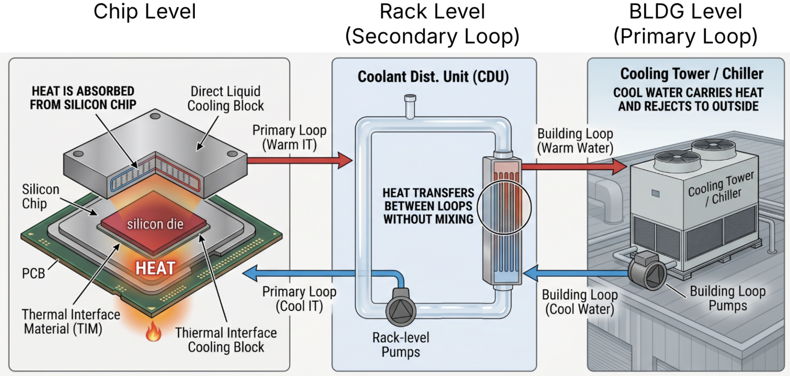
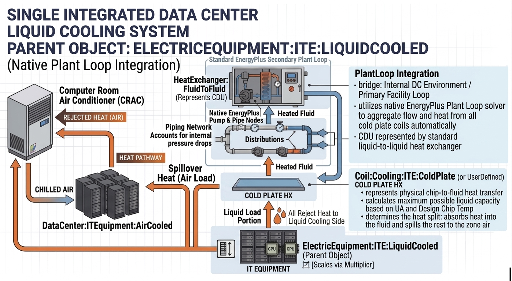

NFP: Liquid-cooled Data Centers
================

**Yujie Xu, Kaiyu Sun, Tianzhen Hong, LBNL**

 - Original Date: June 2026
 - Revision Date: June 2026
 - Status: Draft for Review


## Justification for New Feature ##

The data center industry is rapidly shifting toward higher adoption of liquid cooling technologies, often involving supply water temperatures between 80F and 120F. Currently, EnergyPlus lacks native support for water-cooled or liquid-cooled IT equipment. Users must rely on complex and inefficient workarounds combining the existing air-cooled IT equipment object with plant load profiles and Energy Management System (EMS) scripting. Previous modeling efforts, such as the MOSTCOOL project, had to rely on PlantComponent:UserDefined to link with external piping modules or use HeatExchanger:FluidToFluid to approximate a Coolant Distribution Unit (CDU). These workarounds are not robust, and relying on external modules defeats the goal of having a native, self-contained EnergyPlus solution.

Furthermore, using simple load profiles like LoadProfile:Plant on the fluid side fails to generate an accurate electrical load for proper meter reporting and cannot dynamically monitor actual chip performance constraints. There is also no native capability to accurately model hybrid data centers that utilize a combination of liquid cooling for high-density chips and air cooling for the remaining components not on the liquid loop. A dedicated native liquid-cooled IT equipment object, paired with specific data center cooling coils (such as Coil:Cooling:ITE:ColdPlate), is required to accurately capture these distinct thermal dynamics—calculating the real-time heat split between the fluid and the zone air, and integrating that load directly and seamlessly into standard EnergyPlus plant loops.

## E-mail and Conference Call Conclusions ##

N/A

## Overview ##

Data center liquid cooling efficiently removes massive amounts of heat from high-density electronics by circulating a liquid capable of absorbing and transporting thermal energy much faster than traditional air systems. The continuous process begins at the chip level, where cold plates attached directly to processors capture heat and transfer it to the circulating coolant. This warmed liquid then flows through flexible tubes and safe, quick-disconnect valves into rack-level manifolds, which aggregate the fluid from multiple servers and route it to a Coolant Distribution Unit (CDU). The CDU acts as a vital bridge, utilizing a liquid-to-liquid heat exchanger to safely transfer the thermal energy from the isolated IT cooling loop into the building's primary water loop without the two fluids ever mixing. Finally, at the building level, large pumps send this heated facility water outside to heavy equipment like chillers, dry coolers, or cooling towers, where the collected heat is rejected into the atmosphere before the newly chilled water cycles back inside to repeat the process.


</img>
Figure 1. Schematic of data center liquid cooling at chip, rack, and building level.

This feature enhancement will add native liquid cooling modules to EnergyPlus to accurately model liquid-cooled and hybrid data centers. Liquid-cooled IT equipment is defined as systems cooled by a fluid other than air, such as water, glycol, or refrigerants. To manage these systems natively, the project will introduce a parent IT equipment object (ElectricEquipment:ITE:LiquidCooled) that calculates transient power consumption and scales rack-level loads using a multiplier. Rather than creating isolated internal piping networks, this parent object will pass its thermal load to new dedicated cooling coil objects, such as Coil:Cooling:ITE:ColdPlate or Coil:Cooling:ITE:UserDefined. These coils will connect directly to standard EnergyPlus plant loops. This allows standard HeatExchanger:FluidToFluid and pump objects to accurately represent the CDU, seamlessly integrating the IT equipment into the existing plant architecture.

These new IT and coil components will replace the use of basic load profiles. They will utilize actual component-side heat transfer physics (such as overall thermal resistance and maximum allowable chip temperatures) to accurately calculate the required flow rate and return temperature of the liquid loop. Crucially, this enables native hybrid load splitting: the system dynamically calculates the fraction of server heat captured by the cold plates while the remainder is correctly rejected as an air stream load to the zone. Connecting these components directly to the plant loop architecture enables robust evaluation of heat recovery, cogeneration, and water consumption while supporting flexible controls for high-temperature cooling.

Modeling a cold plate—which conducts heat away from the CPU and rejects it into a circulating liquid—can be approached using either detailed computational fluid dynamics (CFD) or reduced-order system models. Table 1 shows the two main calculation pathways and their key inputs. The proposed EnergyPlus implementation will utilize the System-Level lumped parameter approach.

Table 1. Cold plate calculation pathways and key inputs

| Category | Goal | Typical Software Tools | Key Inputs Required |
| --- | --- | --- | --- |
| Component-Level (CFD) | Optimize internal fins, channels, and pressure drop. | Ansys Fluent, Icepak, Star-CCM+, OpenFOAM, SimScale | Precise 3D geometry (CAD), material thermal properties, coolant fluid properties, boundary conditions (inlet flow, chip heat flux). |
| System-Level (Lumped) | Simulate total cooling plant response, energy use, and safety. | Modelica (Buildings Library), Datacor Fathom/Impulse, EnergyPlus | Performance curves (thermal resistance vs mass flow rate), pressure drop coefficients (K), thermal mass/capacitance, total heat load. |

## Approach ##

The development approach focuses on adding a suite of native data center IT and cooling coil objects that integrate directly into the existing EnergyPlus plant loop architecture. By formatting the liquid cooling hardware as standard EnergyPlus coil objects, this approach leverages the robust, existing plant network solver, allowing users to model Coolant Distribution Units (CDUs) using standard HeatExchanger:FluidToFluid and pump objects. Figure 2 shows a schematic diagram of the added components and their relationships.


</img>
Figure 2. Schematic diagram of the added components.

At the rack level, a new ElectricEquipment:ITE:LiquidCooled parent object natively represents liquid-cooled data center IT equipment racks. This object calculates the total transient IT power load, scales the system using a multiplier for rapid block-modeling of identical racks, and references a specific cooling coil component (e.g., Coil:Cooling:ITE:ColdPlate). By acting as the parent, the IT object calculates the raw thermal load and passes it down to the coil to determine the physical heat transfer split between the liquid loop and the zone air.

At the cooling coil level, the simulation establishes the absolute maximum physical cooling capacity based on the user-defined maximum allowable chip temperature, the real-time fluid inlet conditions provided by the plant loop, and the cold plate's overall thermal resistance (or heat transfer coefficient). During the simulation, the engine continuously scales the nominal thermal resistance using a bivariate modifier curve to account for changing system conditions like varying flow fractions and fluid temperatures. For standard single-phase systems, this physical heat transfer ceiling is calculated using the sensible heat capacity of the liquid and the combined solid and convective thermal resistances.

The final heat transferred into the fluid is set as the smaller value between the targeted rack heat load and this dynamically calculated physical limit. Any remaining target heat that exceeds the cold plate capacity is mathematically diverted directly into the surrounding data hall as a sensible air load. This architecture establishes a seamless, physics-based load-splitting sequence where liquid cooling handles its maximum capable portion of the thermal load, and the uncaptured heat (spillover) acts as an air load on the zone.

While single-phase cooling is the standard for most applications, the proposed Coil:Cooling:ITE:UserDefined object provides an extensible framework for complex or emerging technologies. Rather than hardcoding two-phase fluid properties into EnergyPlus, this object provides Energy Management System (EMS) hooks. Users can deploy custom scripts to calculate two-phase latent heat limits, Rear Door Heat Exchanger (RDHx) air-side interactions, or immersion cooling dynamics, and use EMS actuators to directly override the coil's plant node conditions. Table 2 shows the key fields of the added components.

Table 2. Core fields of the new objects

| Object or interface | Purpose | Key inputs/outputs | Notes |
| --- | --- | --- | --- |
| ElectricEquipment:ITE:LiquidCooled | Calculates transient server power consumption and passes the resulting thermal load to a specified cooling coil. | Zone name, operating schedule, design power input, multiplier, cooling coil object type, cooling coil name. | Uses a multiplier field for rapid scaling of identical racks. Acts as the parent object defining total heat generation. |
| Coil:Cooling:ITE:ColdPlate | Defines the physical heat transfer between the IT equipment and the standard E+ plant loop for single-phase coolants. | Heat transfer input method (UA or thermal resistance), maximum allowable chip temperature, fluid inlet/outlet nodes, design pressure drop. | Establishes the maximum thermal ceiling, dictating when cooling capacity is maxed out and residual heat must spill over into the zone air. |
| Coil:Cooling:ITE:UserDefined | Provides a hook for EMS/Python-driven workflows to override default heat transfer physics at the IT-to-coolant interface. | Fluid inlet/outlet nodes, EMS Program Calling Manager Name, Design Fluid Flow Rate. | Allows researchers to model proprietary two-phase boiling behaviors, RDHx, or immersion cooling while retaining standard E+ plant loop connectivity. |

At a high level, the ElectricEquipment:ITE:LiquidCooled object evaluates the total IT load and passes this target heat load to the referenced Coil:Cooling:ITE:ColdPlate object. Simultaneously, the coil object checks the current fluid supply conditions from the facility plant loop. It calculates the maximum physical heat transfer possible given its thermal properties and the maximum allowable chip temperature. The simulation then evaluates whether the target IT load exceeds this physical maximum. If the cold plate has sufficient capacity, it absorbs the full target heat load; if the capacity is maxed out, the absorbed liquid load is capped at the physical limit.

Any remaining heat, calculated as the total IT power minus the finalized liquid load, is diverted directly into the data center space as a sensible air load. Finally, the E+ plant loop automatically aggregates the heat and fluid flow from all connected cold plate coils. This aggregated hot fluid travels through the standard E+ plant pipe network to the secondary side of a HeatExchanger:FluidToFluid (representing the CDU), which then rejects the data center heat to the primary facility cooling plant.

## Testing/Validation/Data Sources ##

The feature will be tested and demonstrated with a test file derived from a baseline liquid-cooling data center model using a dry cooler as the cooling source, `1ZoneDataCenterCRAHandplant-liquidcooling-NoEMS-drycooler-2CDUs.idf`. Manual checks of the time-step EnergyPlus simulation results will be conducted to ensure the new components accurately calculate secondary loop performance compared to previous HeatExchanger:FluidToFluid approximations.

## Input Output Reference Documentation ##

N/A

## Input Description ##

The following new IDD objects will be added.

```
Coil:Cooling:ITE:ColdPlate,
  A1 , \field Name
       \required-field
       \type alpha
       \reference CoilCoolingITENames
  A2 , \field Availability Schedule Name
       \note Availability schedule name for this system. Schedule value > 0 means the system is available.
       \note If this field is blank, the system is always available.
       \type object-list
       \object-list ScheduleNames
  A3 , \field Heat Transfer Parameter Input Method
       \note Determines how the thermal performance of the cold plate and thermal interface is defined.
       \note UFactorTimesArea uses the overall heat transfer coefficient.
       \note ThermalResistance uses the overall thermal resistance in K/W or C/W.
       \type choice
       \key UFactorTimesArea
       \key ThermalResistance
       \default UFactorTimesArea
  N1 , \field Cold Plate Heat Transfer Coefficient
       \note The design overall heat transfer coefficient (UA value) of the cold plate.
       \note This lumps the internal surface area, material conductivity, and thermal interface material.
       \note Used only if Heat Transfer Parameter Input Method is UFactorTimesArea.
       \type real
       \units W/K
       \minimum> 0.0
  N2 , \field Cold Plate Thermal Resistance
       \note The design overall thermal resistance of the cold plate.
       \note Used only if Heat Transfer Parameter Input Method is ThermalResistance.
       \type real
       \units K/W
       \minimum> 0.0
  A4 , \field Heat Transfer Modifier Curve Name
       \note Name of a bivariate curve that modifies the design heat transfer coefficient or thermal resistance.
       \note For single-phase cooling, independent variables are typically fluid mass flow rate and fluid temperature.
       \note This curve should evaluate to 1.0 at design conditions.
       \type object-list
       \object-list BivariateFunctions
  N3 , \field Target Case Operating Temperature
       \note The desired operating temperature of the processor case.
       \note Used as the setpoint to size the design fluid flow rate and control real-time fluid flow.
       \type real
       \units C
  N4 , \field Maximum Allowable Case Temperature
       \note The maximum safe operating temperature of the processor case.
       \note If fluid flow maxes out and this limit is exceeded, excess heat is rejected to the zone air.
       \type real
       \units C
  N5 , \field Design Fluid Flow Rate
       \note The design mass or volume flow rate of the coolant through the IT equipment.
       \required-field
       \type real
       \units m3/s
       \minimum> 0.0
       \autosizable
  N6 , \field Design Fluid Temperature Difference
       \note The design temperature difference between the fluid outlet and fluid inlet.
       \type real
       \units deltaC
       \minimum> 0.0
       \autosizable
  N7 , \field Design Pressure Drop
       \note The fluid pressure drop across the cold plate at the design fluid flow rate.
       \type real
       \units Pa
       \minimum 0.0
  A5 , \field Pressure Drop Function of Flow Fraction Curve Name
       \note The name of a single-variable curve that modifies the pressure drop as a function of fluid flow fraction.
       \note This captures the changing resistance as fluid flow ramps up or down.
       \note This curve should equal 1.0 at design conditions.
       \type object-list
       \object-list UnivariateFunctions
  A6 , \field Cooling Fluid Inlet Node Name
       \note Node connecting the cold plate to the supply side of the plant loop.
       \required-field
       \type node
  A7 ; \field Cooling Fluid Outlet Node Name
       \note Node connecting the cold plate to the return side of the plant loop.
       \required-field
       \type node
```

```
Coil:Cooling:ITE:UserDefined,
  \memo Allows users to define custom liquid cooling technologies (e.g., Two-Phase Cold Plates,
  \memo Rear Door Heat Exchangers, Immersion) via Energy Management System (EMS) programs.
  A1 , \field Name
       \required-field
  A2 , \field Liquid Inlet Node Name
       \required-field
  A3 , \field Liquid Outlet Node Name
       \required-field
  A4 , \field EMS Program Calling Manager Name
       \note Links to the EMS program that dictates the heat split between liquid and air.
  N1 ; \field Design Liquid Volume Flow Rate
       \units m3/s
       \autosizable
```

```
ElectricEquipment:ITE:LiquidCooled,
  \memo Represents liquid-cooled data center IT equipment racks.
  \memo Calculates power consumption and rejects heat to ITE cooling coils.
  A1 , \field Name
       \required-field
       \type alpha
       \reference ITEAndITEListNames
  A2 , \field Zone or Space Name
       \required-field
       \type object-list
       \object-list ZoneAndSpaceNames
       \note Zone or Space the IT equipment is located in. 
       \note Spillover air heat will be rejected to this space's heat balance.
  A3 , \field Availability Schedule Name
       \type object-list
       \object-list ScheduleNames
       \note Availability schedule name for this equipment. Schedule value > 0 means the equipment is on.
       \note If this field is blank, the equipment is always available.
  A4 , \field Compute Load Schedule Name
       \required-field
       \type object-list
       \object-list ScheduleNames
       \note Defines the transient CPU loading schedule.
       \note This 0-1 factor multiplied by the design power input is the current CPU power.
  N1 , \field Design Power Input
       \required-field
       \type real
       \units W
       \note Max power consumption of a single IT equipment rack.
  N2 , \field Multiplier
       \type real
       \default 1.0
       \minimum 1.0
       \note Scales power and heat to represent multiple identical racks.
  N3 , \field Design Fan Power Input Fraction
       \type real
       \minimum 0.0
       \maximum 1.0
       \note Retained for auxiliary server fans contributing to air load.
  A5 , \field IT Equipment Power Modifier Curve Name
       \type object-list
       \object-list BivariateFunctions
       \note Modifies power based on loading and inlet temperature.
  N4 , \field Liquid Heat Capture Fraction
       \type real
       \minimum 0.0
       \maximum 1.0
       \default 0.8
       \note The fraction of the total ITE heat generation (CPU + Fan) that is removed by the liquid cooling loop at design conditions. The remaining fraction is transferred to the zone air.
  A6 , \field Liquid Heat Capture Fraction Schedule Name
       \type object-list
       \object-list ScheduleNames
       \note If provided, this schedule multiplies the Liquid Heat Capture Fraction field. This allows the capture effectiveness to vary dynamically during the simulation.
  A7 , \field Cooling Coil 1 Object Type
       \required-field
       \type choice
       \key Coil:Cooling:ITE:ColdPlate
       \key Coil:Cooling:ITE:UserDefined
       \note The type of the first cooling component handling physical heat transfer.
  A8 , \field Cooling Coil 1 Name
       \required-field
       \type object-list
       \object-list CoilCoolingITENames
       \note The specific name of the first cooling component handling physical heat transfer.
  N5 , \field Cooling Coil 1 Load Fraction
       \type real
       \minimum 0.0
       \maximum 1.0
       \note A static fraction (0.0 to 1.0) of the total IT liquid load directed to this coil.
       \note If this field is used, the Schedule Name field below should be left blank.
  A9 , \field Cooling Coil 1 Load Fraction Schedule Name
       \type object-list
       \object-list ScheduleNames
       \note Schedule (0.0 to 1.0) defining the fraction of the total IT liquid load directed to this coil.
       \note If this field is used, the static Load Fraction field above should be left blank.
  A10, \field Cooling Coil 2 Object Type
       \type choice
       \key Coil:Cooling:ITE:ColdPlate
       \key Coil:Cooling:ITE:UserDefined
       \note The type of the second cooling component, if applicable (e.g., a secondary RDHx).
  A11, \field Cooling Coil 2 Name
       \type object-list
       \object-list CoilCoolingITENames
  N6 , \field Cooling Coil 2 Load Fraction
       \type real
       \minimum 0.0
       \maximum 1.0
  A12, \field Cooling Coil 2 Load Fraction Schedule Name
       \type object-list
       \object-list ScheduleNames
  A13, \field Cooling Coil 3 Object Type
       \type choice
       \key Coil:Cooling:ITE:ColdPlate
       \key Coil:Cooling:ITE:UserDefined
  A14, \field Cooling Coil 3 Name
       \type object-list
       \object-list CoilCoolingITENames
  N7 , \field Cooling Coil 3 Load Fraction
       \type real
       \minimum 0.0
       \maximum 1.0
  A15, \field Cooling Coil 3 Load Fraction Schedule Name
       \type object-list
       \object-list ScheduleNames
  A16, \field Cooling Coil 4 Object Type
       \type choice
       \key Coil:Cooling:ITE:ColdPlate
       \key Coil:Cooling:ITE:UserDefined
  A17, \field Cooling Coil 4 Name
       \type object-list
       \object-list CoilCoolingITENames
  N8 , \field Cooling Coil 4 Load Fraction
       \type real
       \minimum 0.0
       \maximum 1.0
  A18; \field Cooling Coil 4 Load Fraction Schedule Name
       \type object-list
       \object-list ScheduleNames
```

## Outputs Description ##

The outputs for `ElectricEquipment:ITE:LiquidCooled` are as follows
```
   Zone,Average,ITE CPU Electricity Rate [W]
   Zone,Sum,ITE CPU Electricity Energy [J]
   Zone,Average,ITE Fan Electricity Rate [W]
   Zone,Sum,ITE Fan Electricity Energy [J]
   Zone,Average,ITE Total Electricity Rate [W]
   Zone,Sum,ITE Total Electricity Energy [J]
   Zone,Average,ITE Total Heat Generation Rate [W]
   Zone,Sum,ITE Total Heat Generation Energy [J]
   Zone,Average,ITE Liquid Heat Capture Fraction []
   Zone,Average,ITE Liquid Heat Gain Rate [W]
   Zone,Sum,ITE Liquid Heat Gain Energy [J]
   Zone,Average,ITE Air Heat Gain to Zone Rate [W]
   Zone,Sum,ITE Air Heat Gain to Zone Energy [J]
```

The ITE CPU electricity rate and energy outputs represent the power and energy consumed specifically by the compute components of the IT equipment. The ITE fan electricity rate and energy outputs represent the power and energy consumed by the internal fans used to assist with thermal management within the equipment. The ITE total electricity rate and energy outputs represent the overall power and energy consumption of the liquid-cooled IT equipment, which is the sum of the CPU and fan electricity usage.

The ITE total heat generation rate and energy outputs represent the entire thermal load produced by the equipment, which is inherently equal to the total electricity consumed. The ITE liquid heat capture fraction reports the final fraction of heat being routed to the liquid loop at the current timestep, accounting for the design input field and any modifying schedules. The ITE liquid heat gain rate and energy outputs report the amount of this total heat generation that is captured and removed directly by the attached liquid cooling loop. The ITE air heat gain to zone rate and energy outputs represent the remaining thermal fraction that is not captured by the liquid loop and is instead dissipated into the surrounding zone air as a sensible heat gain. In addition to these core object-level outputs, EnergyPlus will automatically generate corresponding Space and Zone level aggregations for every variable listed above.

The outputs for `Coil:Cooling:ITE:ColdPlate` are as follows.
```
   System,Average,Cooling Coil Total Cooling Rate [W]
   System,Sum,Cooling Coil Total Cooling Energy [J]
   System,Average,Cooling Coil Fluid Mass Flow Rate [kg/s]
   System,Average,Cooling Coil Fluid Inlet Temperature [C]
   System,Average,Cooling Coil Fluid Outlet Temperature [C]
   System,Average,Cooling Coil Fluid Pressure Drop [Pa]
   System,Average,Cooling Coil ITE Case Temperature [C]
```

## Engineering Reference ##

N/A

## Example File and Transition Changes ##

N/A

## References ##

N/A
